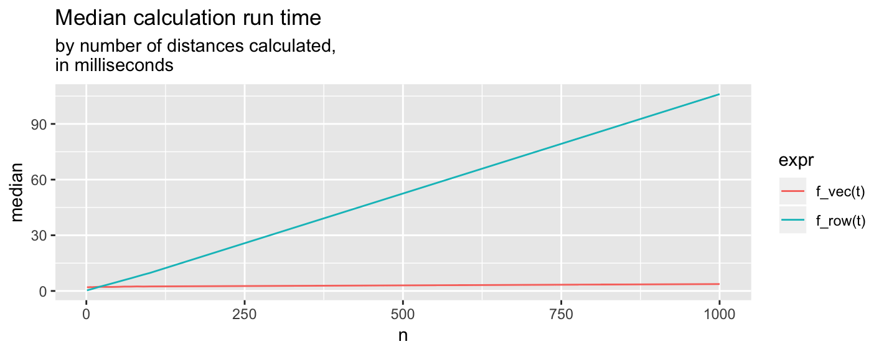

# distGeo_v
A vectorized implementation of geosphere's geodesic distance calculation.

## Usage

    library(geosphere)
    source("https://raw.githubusercontent.com/RomanAbashin/distGeo_v/master/distGeo_v.R")
    
    
    distGeo_v(x, y, xx, yy)

## Benchmarks

## Speed Test

    library(tidyverse)
    library(microbenchmark)

    f_row <- function(t) {

        result <- t %>%
            rowwise() %>%
            mutate(dist = distGeo(c(x, y), c(lag(x), lag(y)))) 

        return(result)

    }

    f_vec <- function(t) {

        result <- t %>%
            mutate(dist = distGeo_v(x, y, lag(x), lag(y))) 

        return(result)

    }

    set.seed(1702)
    for(i in c(1:10, 100, 1000, 10000)) {
        n <- i
        t <- tibble(x = runif(n, -180, 180),
                    y = runif(n, -60, 60))
        mb <- microbenchmark(f_vec(t), f_row(t), unit = "ms")

        tibble_mb <- cbind(data.frame(n = i), summary(mb))
        if(i > 1) {
            result_mb <- rbind(result_mb, tibble_mb)
        } else {
            result_mb <- tibble_mb
        }
    }
